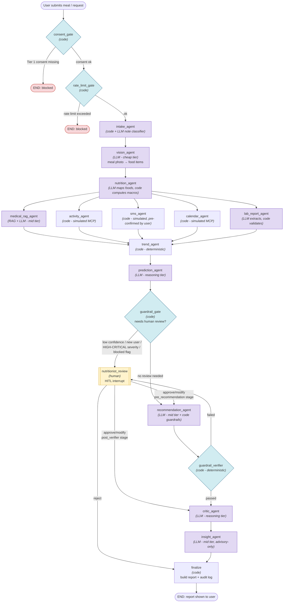

# Health Sentinel

A guardrailed, multi-agent nutrition & lifestyle assistant built on **LangGraph**
(LangChain's low-level orchestration layer), with **RAG over the user's own
medical documents**, **human-in-the-loop (HITL) nutritionist review**, **shared
cross-session memory**, **multi-model cost routing**, and a full **audit
trail**. Built to satisfy every guardrail in
`health-sentinel-guardrails.md` — medical, privacy, AI-safety, consent,
technical, compliance, incident-response, monitoring, and human-oversight.

> ⚠️ This is a demo/reference implementation. MCP connectors (Google Drive,
> iWatch/HealthKit, SMS, Google Calendar) are **simulated** with
> deterministic synthetic data — no real OAuth/HealthKit/SMS-provider calls are made.

## Ask Sentinel LangGraph flow

The Angular Ask Sentinel experience sends the user's sanitized prompt to the
guarded local API, which classifies it with a closed-set structured LLM call and
then runs a LangGraph evidence-synthesis node for supported categories. Vague or
unsupported prompts return a clarification request instead of a canned answer.
See [docs/ask_sentinel_langgraph.md](docs/ask_sentinel_langgraph.md) for the
flow diagram, endpoint, schemas, safety boundaries, and local run commands.

## Architecture decision: LangGraph vs. Deep Agents

Both are LangChain-ecosystem options; this workspace already has an example of
each style (`careertrajectoryoptimizer` uses **Deep Agents**, `OrgPolicyChatBot`
uses a **hand-built RAG pipeline**). Health Sentinel uses **LangGraph directly**
(not Deep Agents), for one core reason:

**Deep Agents** is built for *open-ended, LLM-planned* multi-step work: an
orchestrator LLM decides which specialist subagent to call next via a `task`
tool, and guardrails are expressed as instructions in a system prompt (e.g.
"never recommend peanuts to an allergic user"). That's an excellent fit for
the Career Trajectory Optimizer, where the workflow legitimately branches on
what the LLM decides ("does the user have a goal, or not?").

Health Sentinel's guardrails doc, by contrast, calls for **deterministic, code-
enforced hard stops**: consent gates, rate limits, blocked medical categories,
confidence-threshold gating, severity-based escalation, allergen filtering,
calorie/exercise bounds. If any of these were "an instruction the LLM should
follow" instead of "a graph edge/Python `if` the LLM cannot bypass," they would
be guardrails in name only. **LangGraph's `StateGraph`** — explicit nodes,
conditional edges, a real parallel fan-out/fan-in for the MCP agents, a
checkpointer, and `interrupt()` for HITL — lets every hard stop be enforced in
plain Python *around* the LLM calls, not inside a prompt. Deep Agents is itself
built on LangGraph, so this is "the same foundation, one layer lower" — chosen
deliberately for a health-safety system where "the agent decided to skip a
safety check" is not an acceptable failure mode.

## Multi-agent architecture

Nodes are colored by **who/what makes the decision**: blue = deterministic
code gate, purple = involves an LLM call, yellow = human-in-the-loop, red =
hard-stop `END`. Plain white nodes (`activity_agent`, `sms_agent`,
`calendar_agent`, `trend_agent`, `finalize`) are pure code — no model call.



| # | Node | Type | Model tier | Role |
|---|---|---|---|---|
| — | `consent_gate` | code | — | Hard-stops the run if Tier 1 consent is missing |
| — | `rate_limit_gate` | code | — | Per-user image/analysis rate limiting |
| 0 | `intake_agent` | hybrid | cheap (free-text classifier only) | Turns the day-end staging queue into per-agent inputs; dropdown-tagged attachments route deterministically, un-tagged free text is multi-label classified by an LLM |
| 1 | `vision_agent` | **LLM** | cheap | Meal-photo food recognition; hallucination floor (<0.50 confidence → manual entry) |
| 2 | `nutrition_agent` | hybrid | mid (mapping only) | LLM maps a meal description to canonical food keys; macro/micro totals are then computed deterministically from a fixed nutrition table |
| 3 | `medical_rag_agent` | **LLM** (RAG) | mid | Retrieves + answers from `data/medical_docs/*.md`; refuses rather than fabricates when evidence is weak |
| 4 | `activity_agent` | code | — | iWatch MCP (simulated) — no model call |
| 5 | `sms_agent` | code | — | SMS MCP (simulated) — parsing/keyword matching already happened in `sms_parser.py`; user has already confirmed each item via checkboxes, so this node only shapes the confirmed subset |
| 6 | `calendar_agent` | code | — | Google Calendar MCP (simulated) — stress signal, no model call |
| 7 | `lab_report_agent` | hybrid | mid (extraction only) | LLM proposes candidate lab readings from an uploaded report/photo; every reading is then checked against a metric allowlist + physiological bounds before it's persisted |
| — | `trend_agent` | code | — | Deterministic aggregation/threshold classification of historic metric series — no model call |
| 8 | `prediction_agent` | **LLM** | reasoning | SAFE-category-only predictions + risk dashboard; blocked-category hard stop, confidence cap 0.92, severity gating |
| — | `guardrail_gate` | code | — | Deterministic routing into HITL review based on confidence/severity/new-user/blocked flags |
| — | `nutritionist_review` | **human** | — | HITL `interrupt()` — a human nutritionist approves/modifies/rejects |
| 9 | `recommendation_agent` | hybrid | mid | LLM drafts recommendations + an advisory allergen recall pass; deterministic guardrails (allergen block, calorie/exercise bounds, unproven-supplement/extreme-diet rejection) always run independently and can block on their own |
| — | `guardrail_verifier` | code | — | Authoritative deterministic pass/fail re-check of the raw state, independent of any LLM's self-assessment |
| — | `critic_agent` | **LLM** | reasoning | Advisory-only final guardrail-checklist review before release (never overrides the deterministic verifier) |
| — | `insight_agent` | **LLM** | mid | Advisory-only cross-metric observations; explicitly cannot affect severity, guardrail flags, or run status |
| — | `finalize` | code | — | Assembles the report + writes the audit log entry |

Agents 3, 4, 5, 6, 7 run as a **real parallel fan-out/fan-in** in the graph
(all five execute concurrently after `nutrition_agent`, and `trend_agent`
waits for all five before `prediction_agent` ever runs) — matching the
guardrails doc's "3 Parallel Agents" failure-cascade section.

## Guardrails implemented (see `src/healthsentinel/guardrails/`)

- **`medical.py`** — blocked categories (hard stop), confidence-action table,
  severity escalation (LOW/MEDIUM/HIGH/CRITICAL), mandatory disclaimer,
  medical-history-based prediction weighting, allergen text scanning.
- **`hallucination.py`** — confidence cap (≤0.92), calorie bounds
  (1200–3000/day), exercise bounds (≤150 min/week), unproven-supplement /
  extreme-diet rejection, vision hallucination floor.
- **`bias.py`** — per-demographic-group accuracy variance check (>5% flags),
  socioeconomic guard (whole-food swap before paid supplements).
- **`privacy.py`** — Tier 1/2/3 data classification, RBAC permission table,
  account-number masking.
- **`rate_limit.py`** — per-user image/analysis/API-call rate limits, 3-sigma
  anomaly ("poison data") detection, physiological-validity bounds.

**Human-in-the-loop**: `nutritionist_review` node uses `langgraph.types.interrupt()`
to pause the graph (via the `MemorySaver` checkpointer) whenever: confidence
<0.60, the user is in their first week, severity is HIGH/CRITICAL, or an
upstream guardrail already blocked something. The UI resumes the graph with
`Command(resume={"type": "approve"|"modify"|"reject"})`.

**Shared memory**: `src/healthsentinel/memory/store.py` wraps LangGraph's
`InMemoryStore` (swap for `PostgresStore`/`RedisStore` in production) to
persist per-user preferences, rejected recommendations, consent, and a
cross-session progress note.

**Traceability**: `logging_utils.py` writes structured JSONL to
`logs/audit.jsonl` — timestamp, hashed user id (never raw PII), agent,
redacted input, decision, confidence, severity, latency, status — and mirrors
every event into the graph state so the UI can render a live trace table.

**Evals**: `eval/run_eval.py` is a required pre-deploy gate (mirrors
`OrgPolicyChatBot/scripts/validate_pipeline.py`) checking blocked-category
suppression, confidence capping, disclaimer presence, calorie bounds, rate
limiting, anomaly detection, RAG refusal-vs-answer behavior, consent blocking,
HITL triggering, and end-to-end allergen blocking — **11/11 passing**.

## Multi-LLM cost optimization

Configured in `.env` / `src/healthsentinel/config.py`:

| Env var | Default | Used by |
|---|---|---|
| `HEALTHSENTINEL_CHEAP_MODEL` | `gpt-4o-mini` | Vision agent (meal photo) |
| `HEALTHSENTINEL_MID_MODEL` | `gpt-4o-mini` | Nutrition, medical-RAG, recommendation agents |
| `HEALTHSENTINEL_REASONING_MODEL` | `gpt-4o` | Prediction engine + guardrail critic (highest stakes, lowest volume) |
| `HEALTHSENTINEL_EMBEDDING_MODEL` | `text-embedding-3-small` | Medical-document RAG index |

This keeps the expensive model off the hot path (thousands of meal
photos/day) and reserves it for the two calls that gate what a user actually
sees.

## RAG pipeline (medical documents)

Mirrors `OrgPolicyChatBot`'s design at a complexity level appropriate for a
per-user medical-document corpus:

1. **Ingestion** (`rag/ingestion.py`) — frontmatter/body split, then
   heading-aware section splitting, with a token-bounded recursive fallback
   for oversized sections (same shape as OrgPolicyChatBot's chunker).
2. **Indexing** (`rag/vectorstore.py`) — Chroma + OpenAI embeddings,
   persisted to `data/chroma/` (gitignored).
3. **Retrieval** (`rag/retrieval.py`) — dense similarity + lexical-overlap
   fusion, with an explicit **refusal** path (`refused=True`) when the top
   fused score is below threshold, instead of fabricating an answer.

## Setup

```bash
uv sync
cp .env.example .env   # then add your OPENAI_API_KEY (already pre-filled if you copied from another local project)
uv run python eval/run_eval.py   # guardrail + RAG + HITL eval gate — run before every change
uv run streamlit run app.py      # UI
```

## Project layout

```
healthsentinel/
  app.py                       Streamlit UI (consent, profile, meal input, HITL, audit trail)
  src/healthsentinel/
    config.py                  Multi-LLM router + paths + guardrail thresholds
    state.py                   LangGraph state schema
    graph.py                   StateGraph assembly (nodes, edges, HITL interrupt)
    schemas.py                 Pydantic structured-output schemas per agent
    logging_utils.py           JSONL audit logging (traceability)
    llm.py                     Model-tier factory
    guardrails/                medical.py, hallucination.py, bias.py, privacy.py, rate_limit.py
    memory/store.py            Cross-session shared memory (LangGraph Store)
    agents/                    vision, nutrition, medical_rag, activity, finance, calendar,
                                prediction, recommendation, critic
    rag/                       ingestion.py, vectorstore.py, retrieval.py
    tools/mcp_simulated.py     Simulated Google Drive / iWatch / SMS / Calendar MCPs
  data/
    medical_docs/              Sample user medical history + blood report (frontmatter + sections)
    grounding/nutrition_facts.md   Approved foods / safe bounds for recommendations
  eval/
    cases.py, run_eval.py      Guardrail evaluation harness (required gate)
  logs/audit.jsonl             Append-only structured audit trail (gitignored)
```
