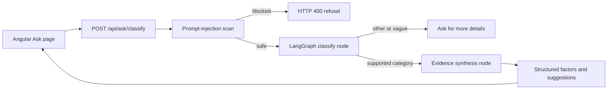

# Ask Sentinel LangGraph Flow

Ask Sentinel uses a guarded backend LangGraph flow instead of returning a fixed
frontend response.

## Request flow



The classifier returns exactly one category:

- `symptom`
- `sleep`
- `nutrition`
- `lab`
- `stress`
- `activity`
- `medication`
- `other`

`other` or any response marked `needs_more_details` ends the graph without
inventing factors. Angular displays the model's reason and asks the user to
provide a concrete symptom or health area before trying again.

## Backend files

- `api.py` exposes the local FastAPI endpoint at `POST /api/ask/classify`.
- `src/healthsentinel/ask_graph.py` defines the dedicated LangGraph flow.
- `src/healthsentinel/agents/ask_agent.py` contains the classifier and evidence
  synthesis nodes.
- `src/healthsentinel/schemas.py` defines the closed-set structured outputs.
- `src/healthsentinel/prompts.py` stores the versioned classifier and synthesis
  prompts.

Both model calls use the existing `call_structured` boundary, which records
model, prompt version, token usage, cost, stop reason, and audit events.

## Evidence synthesis

For a supported question, the synthesis node receives:

- The user's sanitized question and LLM-selected category
- The user's profile conditions and allergies
- Deterministic historic glucose, weight, and sleep trends
- Simulated iWatch activity/sleep data
- Simulated calendar stress data

The LLM may return only these factor categories:

- `sleep_debt`
- `low_magnesium`
- `late_night_meals`
- `lab_flag`
- `elevated_stress`

Every factor includes a source and a confidence label. Suggestions are
structured, general-wellness guidance; the model is instructed not to diagnose
or prescribe medication. Angular renders this structured response directly and
no longer maintains a hard-coded per-profile factor snapshot.

## Safety boundaries

1. Angular performs a UX-level prompt-injection scan.
2. The API repeats the authoritative server-side scan before any model call.
3. User text is placed in a delimited user-data block, not the system prompt.
4. Pydantic `Literal` fields constrain classifier and factor categories.
5. `other` and insufficient-detail responses never proceed to evidence synthesis.
6. Backend failures are displayed as availability errors, separate from safety
   refusals.

This endpoint is intended for local development. In deployment, put the API
behind the application's authenticated service boundary and replace the
localhost CORS origin with the deployed Angular origin.

## Run locally

Start the API:

```bash
uv run uvicorn api:app --host 127.0.0.1 --port 8000
```

Start Angular in another terminal:

```bash
cd frontend
npx ng serve --port 4300
```

The Angular client calls `http://localhost:8000/api/ask/classify`.

## Validation

The implementation was validated with:

- Angular production build
- Python module compilation
- Full backend eval suite: `67/67`
- Vague prompt: returns `other` and asks for more detail
- Concrete prompt such as `I feel a bit dizzy today`: returns `symptom` and
  structured LangGraph analysis
- Prompt injection: blocked before reaching the model
